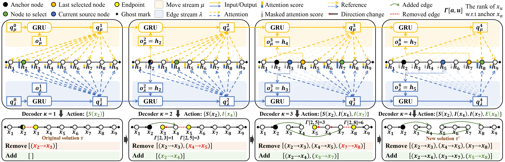

# Learning to Search Feasible and Infeasible Regions of Routing Problems with Flexible Neural k-Opt

NeuOpt is a learning-to-search (L2S) solver for Vehicle Routing Problems (VRPs). It learns to perform flexible k-opt exchanges based on novel designs including:
- **Tailored Action Factorization (S-move, I-move, E-move)**, which simplifies k-opt exchanges and enables autonomous scheduling of dynamic k during search.
- **Customized Recurrent Dual-Stream (RDS) decoder**, which is flexible to control k-opt with any $k\ge2$ and effectively captures the strong correlations between the removed and added edges.
- **Guided Infeasible Region Exploration (GIRE)**, which is the first constraint handling scheme that promotes autonomous exploration of both feasible and infeasible regions beyound feasibility masking.
- **Dynamic Data Augmentation (D2A)**, which enables NeuOpt to explicitly escape from the local optima.


GIF 1: NeuOpt Search Process for TSP (left: current solution, right: best-so-far solution)


GIF 2: NeuOpt-GIRE Search Process for CVRP (green: feasible, red: infeasible)

# Paper


This repo implements our paper:

Yining Ma, Zhiguang Cao, and Yeow Meng Chee, “[Learning to Search Feasible and Infeasible Regions of Routing Problems with Flexible Neural k-Opt](https://arxiv.org/abs/2310.18264)”, in Advances in Neural Information Processing Systems, vol. 36, 2023.

Please cite our paper if the code is useful for your project.
```
@inproceedings{
    ma2023neuopt,
    title={Learning to Search Feasible and Infeasible Regions of Routing Problems with Flexible Neural k-Opt},
    author={Ma, Yining and Cao, Zhiguang and Chee, Yeow Meng},
    booktitle = {Advances in Neural Information Processing Systems},
    volume = {36},
    year={2023}
}
```

# Hints for First-Time Users
We have prepared two Jupyter Notebooks to help you get started: ["NeuOpt_Example"](./NeuOpt_Example.ipynb) and ["GIRE_Example"](./GIRE_Example.ipynb)


# Dependencies
* Python=3.10.8
* PyTorch=1.13.1
* numpy
* tensorboard_logger
* tqdm

# Usage
## Generating data
Training data is automatically generated on the fly during reinforcement learning. We have provided some randomly generated test data in the [datasets](./datasets) folder.

## Training
kindly change `--k {the K in the paper}` to control the maximum K for flexible k-opt
### TSP examples
20 nodes:
```python
CUDA_VISIBLE_DEVICES=0 python run.py --problem tsp --val_dataset datasets/tsp_20.pkl --graph 20 --warm_up 1 --val_m 1 --T_train 200 --n_step 4 --batch_size 512 --epoch_size 10240 --max_grad_norm 0.05 --val_size 1000 --val_batch_size 1000 --T_max 1000 --stall 0 --k 4 --init_val_met random --run_name 'example_training_TSP20'
```

50 nodes:
```python
CUDA_VISIBLE_DEVICES=0 python run.py --problem tsp --val_dataset datasets/tsp_50.pkl --graph 50 --warm_up 0.5 --val_m 1 --T_train 200 --n_step 4 --batch_size 512 --epoch_size 10240 --max_grad_norm 0.05 --val_size 1000 --val_batch_size 1000 --T_max 1000 --stall 0 --k 4 --init_val_met random --run_name 'example_training_TSP50'
```

100 nodes:
```python
CUDA_VISIBLE_DEVICES=0,1 python run.py --problem tsp --val_dataset datasets/tsp_100.pkl --graph 100 --warm_up 0.25 --val_m 1 --T_train 200 --n_step 4 --batch_size 512 --epoch_size 10240 --max_grad_norm 0.05 --val_size 1000 --val_batch_size 1000 --T_max 1000 --stall 0 --k 4 --init_val_met random --run_name 'example_training_TSP100'
```
### CVRP examples
20 nodes:
```python
CUDA_VISIBLE_DEVICES=0 python run.py --proble cvrp --val_dataset datasets/cvrp_20.pkl --dummy_rate 0.5 --graph 20 --warm_up 1 --val_m 1 --T_train 250 --n_step 5 --batch_size 600 --epoch_size 12000 --max_grad_norm 0.05 --val_size 1000 --val_batch_size 1000 --T_max 1000 --stall 0 --k 4  --init_val_met random --run_name 'example_training_CVRP20'
```

50 nodes:
```python
CUDA_VISIBLE_DEVICES=0,1 python run.py --proble cvrp --val_dataset datasets/cvrp_50.pkl --dummy_rate 0.4 --graph 50 --warm_up 0.5 --val_m 1 --T_train 250 --n_step 5 --batch_size 600 --epoch_size 12000 --max_grad_norm 0.05 --val_size 1000 --val_batch_size 1000 --T_max 1000 --stall 0 --k 4 --init_val_met random --run_name 'example_training_CVRP50'
```

100 nodes:
```python
CUDA_VISIBLE_DEVICES=0,1,2,3 python run.py --proble cvrp --val_dataset datasets/cvrp_100.pkl --dummy_rate 0.2 --graph 100 --warm_up 0.25 --val_m 1 --T_train 250 --n_step 5 --batch_size 600 --epoch_size 12000 --max_grad_norm 0.05 --val_size 1000 --val_batch_size 1000 --T_max 1000 --stall 0 --k 4 --init_val_met random --run_name 'example_training_CVRP100'
```

### Warm start
You can initialize a run using a pretrained model by adding the --load_path option:
```python
--load_path '{add model to load here}'
```
### Resume Training
You can resume a training by adding the --resume option:
```python
--resume '{add last saved checkpoint(model) to resume here}'
```
The Tensorboard logs will be saved to folder "logs" and the trained model (checkpoint) will be saved to folder "outputs".

## Inference
Load the model and specify the following hyper-parameters for inference:

```python
--eval_only --no_saving --no_tb # set to eval mode
--load_path '{add pre-trained model to load here}'
--val_dataset '{add dataset here}' 
--val_size 10000 # total number of test instances
--val_batch_size 5000 # set batch size according to GPU memeory
--val_m '{add number of D2A augmentations here}'
--stall '{add T_D2A here} (we use 10)'
--T_max 5000  # inference iterations (steps)
```

See [options.py](./options.py) for detailed help on the meaning of each argument. 

We provide pre-trained models for TSP and CVRP of size 20, 50, 100, and 200 in the [pre-trained](./pre-trained/) folder. These models are trained based on K=4.

### TSP-100 Example
We use:
D2A=1, (--val_m 1),
T_D2A=10 (--stall 10), 
T=1k (--T_max 1000), K=4 (--k 4)
```
CUDA_VISIBLE_DEVICES=0,1,2,3 python run.py --eval_only --no_saving --no_tb --init_val_met random --val_size 10000 --val_batch_size 10000 --k 4 --problem tsp --val_dataset datasets/tsp_100.pkl --graph 100 --val_m 1 --stall 10 --T_max 1000 --load_path pre-trained/tsp100.pt
```

### CVRP-100 Example
We use:
D2A=1, (--val_m 1),
T_D2A=10 (--stall 10), 
T=1k (--T_max 1000),  K=4 (--k 4)
```
CUDA_VISIBLE_DEVICES=0,1,2,3 python run.py --eval_only --no_saving --no_tb --init_val_met random --val_size 10000 --val_batch_size 10000 --k 4 --problem cvrp --val_dataset datasets/cvrp_100.pkl --graph 100 --dummy_rate 0.2 --val_m 1 --stall 10 --T_max 1000 --load_path pre-trained/cvrp100.pt
```

# Acknowledgements
The code and the framework are based on our previous repos [yining043/PDP-N2S](https://github.com/yining043/PDP-N2S/) and [yining043/VRP-DACT](https://github.com/yining043/VRP-DACT).

You may also find our [N2S](https://github.com/yining043/PDP-N2S) and [DACT](https://github.com/yining043/VRP-DACT) useful.
```
@inproceedings{ma2022efficient,
  title     = {Efficient Neural Neighborhood Search for Pickup and Delivery Problems},
  author    = {Ma, Yining and Li, Jingwen and Cao, Zhiguang and Song, Wen and Guo, Hongliang and Gong, Yuejiao and Chee, Yeow Meng},
  booktitle = {Proceedings of the Thirty-First International Joint Conference on
               Artificial Intelligence, {IJCAI-22}},
  pages     = {4776--4784},
  year      = {2022},
  month     = {7},
}
```
```
@inproceedings{ma2021learning,
 author = {Ma, Yining and Li, Jingwen and Cao, Zhiguang and Song, Wen and Zhang, Le and Chen, Zhenghua and Tang, Jing},
 booktitle = {Advances in Neural Information Processing Systems},
 pages = {11096--11107},
 title = {Learning to Iteratively Solve Routing Problems with Dual-Aspect Collaborative Transformer},
 volume = {34},
 year = {2021}
}
```
